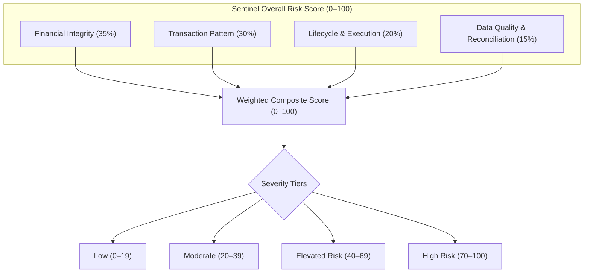
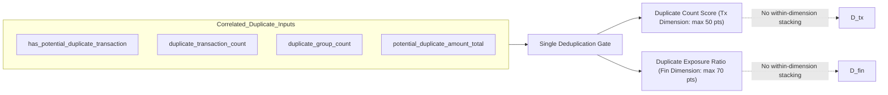
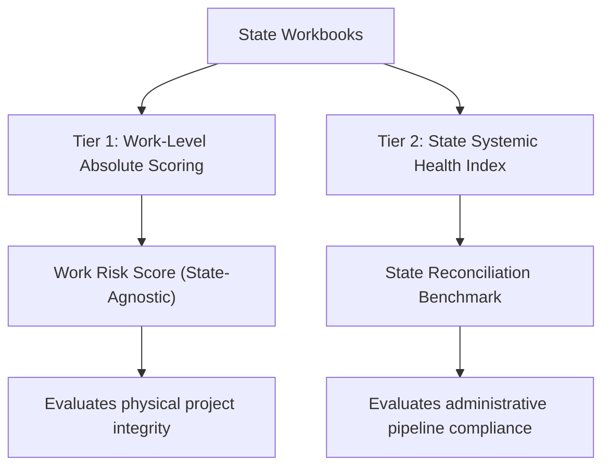
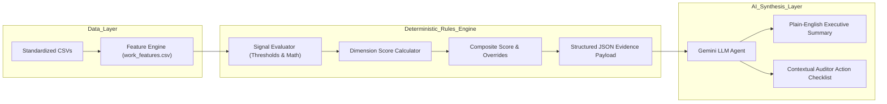

# Sentinel Risk Score v1: Analytical Design & Scoring Framework
**Specification Document — Version 1.0 (Prototype)**  
*Project Sentinel: AI-Powered MPLADS Monitoring & Anomaly Detection*  
*Dataset Grounding: Andhra Pradesh, Madhya Pradesh, Punjab, Telangana, Uttarakhand (1,000 works, 1,386 transactions)*  

---

## 1. Objective

The primary objective of **Sentinel Risk Score v1** is to provide an objective, mathematically defensible, and explainable prototype system that prioritizes MPLADS developmental works for human review and administrative audit.

### Core Design Principles
1. **Explainable by Construction**: Every point in the score must trace directly to verifiable evidence (e.g., specific transaction IDs, mathematical ratios, milestone dates). A reviewer must never be faced with an opaque "black-box" risk rating.
2. **Non-Accusatory Classification**: Risk is framed strictly as an operational or procedural anomaly requiring review. The system distinguishes between intentional compliance failures, data-quality artifacts, and benign administrative peculiarities. Terms like "fraud" or "fraudulent" are prohibited; the system operates on categories such as *Potential Anomaly*, *Review Required*, *Data Quality Issue*, *Elevated Risk*, and *High Risk*.
3. **Decoupling Data Quality from Financial Risk**: Incomplete records or government workbook formatting inconsistencies must not be conflated with financial irregularities or redundant payments.
4. **Distribution-Aware Calibration**: Thresholds are grounded in empirical distributions of actual multi-state MPLADS data rather than arbitrary rules of thumb.
5. **Separation of Deterministic Evidence and AI Synthesis**: Deterministic algorithms compute all scores, ratios, and signal triggers. Large Language Models (LLMs) are used solely to translate structured JSON evidence into fluent, context-aware executive summaries and auditor checklists.

---

## 2. Risk Dimensions

To prevent single indicators from distorting the overall evaluation, Sentinel v1 organizes all evidence into **four orthogonal dimensions**, each scored independently from **0 to 100**:



### Dimension 1: Financial Integrity ($D_{\text{fin}}$, Weight: 35%)
Evaluates financial scale, fund allocation coherence, and redundant disbursement exposure.
- **Key Concepts**: Potential duplicate disbursed amount relative to total expenditure, orphan disbursements, and financial completeness upon milestone achievement.
- **Focus**: Has money been disbursed under questionable circumstances, or has public money been double-counted?

### Dimension 2: Transaction Pattern ($D_{\text{tx}}$, Weight: 30%)
Evaluates procurement slicing, voucher frequency, vendor concentrations, and duplicate payment clusters.
- **Key Concepts**: Transaction count relative to work size, vendor proliferation (micro-vouchers), exact attribute matching (same date, vendor, amount), and disbursement velocity.
- **Focus**: Does the execution structure suggest invoice splitting, repeated billing, or artificial procurement bypasses?

### Dimension 3: Lifecycle & Execution ($D_{\text{life}}$, Weight: 20%)
Evaluates milestone consistency, administrative delays, and project stagnation.
- **Key Concepts**: Disconnect between administrative status and financial expenditure (e.g., 100% funds disbursed while officially in "Vendor Identification"), prolonged inactivity (> 1 year without expenditure on uncompleted works), and certified completions without physical records.
- **Focus**: Is the project progressing logically along statutory milestones, or is it stalled/prematurely billed?

### Dimension 4: Data Quality & Reconciliation ($D_{\text{dq}}$, Weight: 15%)
Evaluates schema completeness, relational integrity across sheets, and catalog health.
- **Key Concepts**: Unmatched transaction work IDs (orphan disbursements), missing recommendation dates, unpopulated disbursement entries, and source-level cross-referencing notes.
- **Focus**: Can the work be fully reconciled across government ledgers, or does the file suffer from broken relational links?

---

## 3. Signal Taxonomy & Severity Weights

Signals within each dimension carry defined base severity points. Individual dimensions are capped at 100.

| Dimension | Signal Identifier | Signal Name | Base Points | Trigger Condition / Formula | Empirical Prevalence in 5-State Dataset |
| :--- | :--- | :--- | :---: | :--- | :--- |
| **Financial Integrity** | `FIN_DUP_EXPOSURE_HIGH` | High Duplicate Financial Exposure | 40–70 | $\frac{\text{potential\_dup\_amt}}{\text{total\_exp}} \ge 0.30$ (scaled up to 70 for $\ge 0.60$) | 14 works (1.4%) |
| | `FIN_DUP_EXPOSURE_MOD` | Moderate Duplicate Financial Exposure | 25 | $0.05 \le \frac{\text{potential\_dup\_amt}}{\text{total\_exp}} < 0.30$ | 8 works (0.8%) |
| | `FIN_ORPHAN_FUNDS` | Orphan Transaction Disbursement | 60 | Work exists in expenditure logs but has no Works Master parent | 14 works / 38 txs (2.7% of txs, Punjab) |
| | `FIN_CERTIFIED_ZERO_DISB`| Certified Completed with Zero Funds | 35 | `work_status` == "Work Completed" AND `total_exp` is NULL | 4 works (0.4%, AP & Telangana) |
| | `FIN_SEVERE_UNDER_UTIL` | Severe Under-Expenditure at Completion | 20 | `work_status` == "Work Completed" AND $\frac{\text{total\_exp}}{\text{sanction\_amt}} < 0.40$ | 3 works (0.3%) |
| **Transaction Pattern** | `TX_EXACT_DUP_CLUSTER` | Repeated Transaction Duplication | 30–50 | $\ge 2$ duplicates: 30 pts; $\ge 5$ duplicates: 40 pts; $\ge 10$: 50 pts | 22 works (2.2%) |
| | `TX_SLICING_EXTREME` | Extreme Transaction Slicing | 35 | `exp_tx_count` $\ge 15$ (top 1% percentile) | 9 works (0.9%) |
| | `TX_SLICING_HIGH` | High Transaction Slicing | 20 | $6 \le \text{exp_tx_count} < 15$ (P95–P99) | 42 works (4.2%) |
| | `TX_VENDOR_SPRAWL_EXTREME`| Extreme Vendor Sprawl | 35 | `unique_vendor_count` $\ge 8$ | 10 works (1.0%) |
| | `TX_VENDOR_SPRAWL_HIGH` | High Vendor Concentration | 20 | $3 \le \text{unique_vendor_count} < 8$ (P90–P95) | 45 works (4.5%) |
| | `TX_PREMATURE_BILLING` | Substantial Premature Expenditure | 30 | Status in (`Sanction`, `Vendor Identification`) AND $\frac{\text{total\_exp}}{\text{sanction}} \ge 0.75$ | 67 works (6.7%) |
| **Lifecycle / Execution**| `LIFE_PROLONGED_STAGNATION`| Prolonged Inactivity on Active Work | 30 | Active work with `days_since_last_expenditure` $> 445$ days (P90) | 66 works (6.6%) |
| | `LIFE_SEVERE_DELAY_SANCTION`| Abnormal Sanction Lead Time | 20 | `days_to_sanction` $> 323$ days (P95) | 40 works (4.0%) |
| | `LIFE_SEVERE_DELAY_COMP` | Abnormal Completion Duration | 25 | `days_to_completion` $> 477$ days (P95) | 11 works (1.1%) |
| | `LIFE_STATUS_DISCONNECT` | Milestone Sequencing Inconsistency | 25 | Physical status backward relative to financial disbursement | 34 works (3.4%) |
| **Data Quality** | `DQ_ORPHAN_INTEGRITY` | Missing Master Work Record | 60 | Referential integrity broken between expenditure and works | 14 works (Punjab) |
| | `DQ_MISSING_REC_SERIES` | Disjoint Recommendation Series | 30 | State-level recommendation ID mismatch (AP pattern) | 200 works (AP) |
| | `DQ_MISSING_STATUTORY_DISB`| Unpopulated Master Disbursement | 15 | `amount_disbursed` is null on active/completed projects | 733 works (73.3%) |
| | `DQ_MISSING_CORE_DESC` | Incomplete Work Description | 20 | `work_description` is null or empty string | 3 works (0.3%) |

---

## 4. Threshold Calibration (Empirical Grounding)

Arbitrary cutoffs undermine system credibility. Sentinel v1 thresholds are calibrated directly against empirical quantiles from the 1,000-work baseline dataset:

```text
Dataset Quantile Reference (Active Works N=660, Individual Txs N=1,386)
-----------------------------------------------------------------------------------------
Metric                         P50 (Median)   P75         P90         P95         P99
-----------------------------------------------------------------------------------------
Transaction Count / Work       1 tx           2 txs       4 txs       8 txs       16 txs
Vendor Count / Work            1 vendor       1 vendor    2 vendors   5 vendors   9.4 vendors
Days Since Last Expenditure    156 days       290 days    445 days    499 days    601 days
Days to Sanction               68 days        128 days    221 days    323 days    462 days
Days to Completion             236 days       327 days    418 days    477 days    561 days
Individual Tx Amount (₹)       ₹1,00,769      ₹3,69,119   ₹6,80,245   ₹10,23,007  ₹25,14,913
```

### Justification of Specific Cutoffs
1. **Transaction Slicing (`TX_SLICING_HIGH` vs `TX_SLICING_EXTREME`)**:
   - Median transaction count is 1. Works with $\ge 6$ transactions fall strictly in the **top 5% ($> \text{P95}$)**. Works with $\ge 15$ transactions represent the **top 1% ($> \text{P99}$)**.
   - *Rationale*: MPLADS community works (borewells, community halls, small roads) typically involve 1–2 progress tranches. Slicing into 15–29 vouchers strongly indicates avoidance of single-voucher authorization thresholds.
2. **Vendor Count (`TX_VENDOR_SPRAWL_HIGH` vs `TX_VENDOR_SPRAWL_EXTREME`)**:
   - 90% of works in the dataset employ $\le 2$ vendors. Works with $\ge 3$ vendors represent the top 10%; works with $\ge 8$ vendors represent extreme anomalies (top 1%).
   - *Rationale*: A simple rural road or hall should not require 13 to 21 distinct contracting entities.
3. **Stagnation Threshold (`LIFE_PROLONGED_STAGNATION` at 445 Days)**:
   - Calibrated to the empirical 90th percentile of `days_since_last_expenditure`. Works that have had no payment activity for $> 445$ days (nearly 15 months) while still not marked completed represent stalled or abandoned execution.
4. **Duplicate Financial Exposure ($30\%$ and $60\%$)**:
   - Rather than relying on simple row counts, the ratio $\frac{\text{potential\_duplicate\_amount}}{\text{total\_expenditure}}$ scales the true financial risk. If $> 30\%$ of a project's payments are duplicates, it receives elevated priority; if $> 60\%$ (as in Punjab's `WS/MP18152/2025-2026/220384`), it indicates severe accounting failure.

---

## 5. Double-Counting Prevention Architecture

In naive scoring engines, correlated features produce compounded scores that artificially inflate risk. Sentinel v1 employs explicit **de-duplication rules**:



### Specific Prevention Rules
1. **Unification of Duplicate Transaction Features**:
   - `has_potential_duplicate_transaction`, `duplicate_transaction_count`, `duplicate_group_count`, and `potential_duplicate_amount_total` all describe the same underlying event.
   - *Resolution*: 
     - In **Transaction Pattern ($D_{\text{tx}}$)**, score **only** the cluster intensity (`TX_EXACT_DUP_CLUSTER`: 30, 40, or 50 pts based on count). Do not add separate points for group count or boolean presence.
     - In **Financial Integrity ($D_{\text{fin}}$)**, score **only** the monetary exposure ratio ($\frac{\text{potential\_dup\_amt}}{\text{total\_exp}}$).
2. **Mutual Exclusivity of Slicing Tiers**:
   - A work triggering `TX_SLICING_EXTREME` ($\ge 15$ txs) does **not** also collect points for `TX_SLICING_HIGH` ($\ge 6$ txs). Only the highest applicable tier fires.
3. **Mutual Exclusivity of Vendor Sprawl Tiers**:
   - `TX_VENDOR_SPRAWL_EXTREME` ($\ge 8$ vendors) supersedes `TX_VENDOR_SPRAWL_HIGH` ($\ge 3$ vendors).
4. **Interaction Rules (Synergy Capping)**:
   - When multiple related anomalies co-occur (e.g., extreme slicing + multi-vendor + duplicates), an interaction multiplier of $1.15\times$ is applied to the dimension, but the dimension remains strictly capped at 100 points.

---

## 6. Scoring Formula & Aggregation Algorithm

### Mathematical Definition

For any given work $w$:

1. **Calculate Dimension Raw Scores**:
   $$D_{\text{fin}}(w) = \min\left(100, \sum_{s \in S_{\text{fin}}} \text{Points}(s)\right)$$
   $$D_{\text{tx}}(w) = \min\left(100, \left(\sum_{s \in S_{\text{tx}}} \text{Points}(s)\right) \times \text{Multiplier}(w)\right)$$
   $$D_{\text{life}}(w) = \min\left(100, \sum_{s \in S_{\text{life}}} \text{Points}(s)\right)$$
   $$D_{\text{dq}}(w) = \min\left(100, \sum_{s \in S_{\text{dq}}} \text{Points}(s)\right)$$

   *Where $\text{Multiplier}(w) = 1.15$ if both `TX_SLICING_HIGH` and `TX_VENDOR_SPRAWL_HIGH` trigger simultaneously; otherwise $1.0$.*

2. **Calculate Composite Weighted Risk Score**:
   $$\text{RiskScore}(w) = 0.35 \cdot D_{\text{fin}}(w) + 0.30 \cdot D_{\text{tx}}(w) + 0.20 \cdot D_{\text{life}}(w) + 0.15 \cdot D_{\text{dq}}(w)$$

3. **Critical Override Rule**:
   If $D_{\text{fin}}(w) \ge 70$ (e.g., majority of funds are duplicate disbursements or orphan funds), the composite score cannot be lower than 70 regardless of other dimensions:
   $$\text{FinalRiskScore}(w) = \max\left(\text{RiskScore}(w), \mathbf{1}_{D_{\text{fin}}(w) \ge 70} \cdot 70\right)$$

### Severity Tiers

```text
+-----------------------+---------------------+-------------------------------------------------------+
| Score Range           | Risk Classification | Operational Meaning                                   |
+-----------------------+---------------------+-------------------------------------------------------+
| 0 – 19                | Low / Normal        | Standard execution; benign administrative variance.   |
| 20 – 39               | Moderate            | Minor friction, mild delay, or documentation gap.     |
| 40 – 69               | Elevated Risk       | Notable anomaly pattern; supervisory audit suggested. |
| 70 – 100              | High Risk           | Severe multi-signal anomaly; priority human review.   |
+-----------------------+---------------------+-------------------------------------------------------+
```

---

## 7. State Normalization Strategy

A critical question identified during analysis is how to handle systemic state-level variations (e.g., Punjab containing 100% of orphan transactions and 76.8% of all duplicates; Andhra Pradesh having 100% missing recommendation dates).

### Resolution: Two-Tier Decoupled Architecture



1. **Individual Work Scores Remain Absolute (State-Agnostic)**:
   - An identical ₹7.3 Lakh duplicate payment to the same vendor on the same date must receive the exact same risk severity whether it occurs in Punjab, Madhya Pradesh, or Telangana.
   - *Rationale*: Diluting a project's score because its host state has widespread documentation issues would hide acute irregularities from central auditors.
2. **Missing Feature Neutralization (AP Correction)**:
   - Because 100% of Andhra Pradesh works lack `recommended_date` due to a workbook numbering disconnect, calculating `days_to_sanction` is impossible for AP.
   - *Resolution*: For works where baseline dates are systemically absent at the state level, the `Lifecycle` dimension re-weights available features rather than penalizing works for missing dates. The omission is recorded exclusively in `Data Quality ($D_{\text{dq}}$)`.
3. **State Systemic Health Index (Macro-Level)**:
   - Sentinel publishes a separate macro-level dashboard metric for state administrative health:
     - **Reconciliation Integrity Rating**: Punjab flagged for orphan transaction series (MP381).
     - **Data Consistency Rating**: Andhra Pradesh flagged for recommendation catalog disconnect.

---

## 8. Real-Work Example Calculations

The scoring model was executed against three real works from the 1,000-work baseline dataset.

### Case 1: Relatively Normal Work (Baseline Community Project)
- **Work ID**: [`WS/MP524/2024-2025/168911`](file:///c:/Users/jain_/Documents/SIH_dataset/processed/andhra_pradesh/works.csv#L5)
- **State & Constituency**: Andhra Pradesh, RAJAMPET
- **Work Title**: Installing tube-wells and borewells at Cheekalachenu, Moravapalli GP
- **Key Metrics**: Sanction: ₹1,94,855.00 | Disbursed: ₹1,94,855.00 | Total Exp: ₹1,94,855.00 | Status: `Physical Inspection` | Tx Count: 1 | Vendor Count: 1 | Duplicates: 0 | Completion Date: 2025-03-24
- **Signal Triggers**:
  - `DQ_MISSING_REC_SERIES` (AP state-wide recommendation mapping note): 15 pts in $D_{\text{dq}}$.
- **Dimension Scores**:
  - $D_{\text{fin}} = 0$
  - $D_{\text{tx}} = 0$
  - $D_{\text{life}} = 0$
  - $D_{\text{dq}} = 15$
- **Composite Score**:
  $$\text{Score} = (0.35 \times 0) + (0.30 \times 0) + (0.20 \times 0) + (0.15 \times 15) = 2.25 \rightarrow \mathbf{2}$$
- **Risk Level**: **Low / Normal**
- **Explanation**: The work exhibits 100% financial consistency with exactly 1 transaction to 1 vendor matching the sanctioned budget. Milestones have proceeded from sanction to physical inspection with zero duplication. The minimal score reflects only the state-wide recommendation catalog uncoupling.

---

### Case 2: Clearly High-Risk Work (Extreme Compounded Anomaly)
- **Work ID**: [`WS/MP18152/2025-2026/220384`](file:///c:/Users/jain_/Documents/SIH_dataset/processed/punjab/work_features.csv#L10)
- **State & Constituency**: Punjab, FARIDKOT (SC)
- **Work Title**: Construction of roads, link roads, pathways or any other road with drainage
- **Key Metrics**: Sanction: ₹15,00,000.00 | Total Exp: ₹15,00,000.00 (100% spent) | Status: `Vendor Identification` | Tx Count: 29 (highest in dataset) | Vendor Count: 2 | Duplicates: 25 | Potential Dup Amount: ₹9,46,275.00
- **Signal Triggers**:
  - Financial: `FIN_DUP_EXPOSURE_HIGH` ($\frac{9,46,275}{15,00,000} = 63.1\%$ duplicate ratio): **70 pts**
  - Transaction: `TX_SLICING_EXTREME` (29 txs): **35 pts**
  - Transaction: `TX_EXACT_DUP_CLUSTER` (25 duplicate records): **50 pts**
  - Transaction: `TX_PREMATURE_BILLING` (100% budget exhausted during `Vendor Identification`): **30 pts**
  - Lifecycle: `LIFE_STATUS_DISCONNECT` (Full funds disbursed prior to execution phase): **25 pts**
- **Dimension Scores**:
  - $D_{\text{fin}} = 70$
  - $D_{\text{tx}} = \min(100, (35 + 50 + 30) \times 1.0) = \min(100, 115) = 100$
  - $D_{\text{life}} = 25$
  - $D_{\text{dq}} = 15$ (unpopulated master disbursement)
- **Composite Score**:
  $$\text{Score} = (0.35 \times 70) + (0.30 \times 100) + (0.20 \times 25) + (0.15 \times 15) = 24.5 + 30.0 + 5.0 + 2.25 = 61.75$$
  *Applying Critical Override Rule ($D_{\text{fin}} \ge 70$): Score elevated to 70.*
  $$\mathbf{\text{Final Score} = 70}$$
- **Risk Level**: **High Risk (Review Required)**
- **Explanation**: This project displays severe, compounded procedural anomalies. The entire sanctioned allocation (₹15 Lakhs) was disbursed across 29 fragmented transactions while the project remains officially categorized under preliminary "Vendor Identification". Crucially, 25 of the 29 transactions are exact duplicates, representing ₹9,46,275 in redundant disbursements (63.1% of total project expenditure).

---

### Case 3: Data Quality & Reconciliation Anomaly (Certified Complete without Financial Trail)
- **Work ID**: [`WS/MP18009/2024-2025/161404`](file:///c:/Users/jain_/Documents/SIH_dataset/processed/andhra_pradesh/works.csv#L58)
- **State & Constituency**: Andhra Pradesh, BAPATLA (SC)
- **Work Title**: Construction of community centers and community halls
- **Key Metrics**: Sanction: ₹10,00,000.00 | Disbursed: NULL | Total Exp: NULL (0 txs) | Status: `Work Completed` | Completion Date: 2025-09-02
- **Signal Triggers**:
  - Financial: `FIN_CERTIFIED_ZERO_DISB` (Marked complete with ₹0 recorded funds): **35 pts**
  - Lifecycle: `LIFE_STATUS_DISCONNECT` (Project certified closed without financial activity): **25 pts**
  - Data Quality: `DQ_MISSING_STATUTORY_DISB` (Master disbursement unpopulated): **15 pts**
  - Data Quality: `DQ_MISSING_REC_SERIES` (State catalog uncoupling): **15 pts**
- **Dimension Scores**:
  - $D_{\text{fin}} = 35$
  - $D_{\text{tx}} = 0$ (0 transactions)
  - $D_{\text{life}} = 25$
  - $D_{\text{dq}} = 30$
- **Composite Score**:
  $$\text{Score} = (0.35 \times 35) + (0.30 \times 0) + (0.20 \times 25) + (0.15 \times 30) = 12.25 + 0 + 5.0 + 4.5 = 21.75 \rightarrow \mathbf{22}$$
- **Risk Level**: **Moderate (Data Quality Issue)**
- **Explanation**: The work represents an administrative reconciliation discrepancy rather than a financial irregularity. The physical structure was certified completed on 2025-09-02, but zero financial expenditure records exist in either the master or transaction logs. The work requires data reconciliation to record actual expenditure or clarify whether the asset was completed via an alternative funding mechanism.

---

## 9. JSON Output Contract (Backend Specification)

Sentinel backend services will generate this structured payload for every evaluated work:

```json
{
  "work_id": "WS/MP18152/2025-2026/220384",
  "state": "Punjab",
  "constituency": "FARIDKOT(SC)",
  "mp_name": "SARABJEET SINGH KHALSA",
  "work_category": "Normal/Others",
  "work_title": "Construction of roads, link roads, pathways or any other road with or without drainage system",
  "sanction_amount": 1500000.0,
  "total_expenditure": 1500000.0,
  "amount_disbursed": null,
  "work_status": "Vendor Identification",
  "risk_score": 70,
  "risk_level": "High Risk",
  "requires_human_review": true,
  "dimension_scores": {
    "financial_integrity": 70,
    "transaction_pattern": 100,
    "lifecycle_execution": 25,
    "data_quality": 15
  },
  "summary_metrics": {
    "expenditure_transaction_count": 29,
    "unique_vendor_count": 2,
    "duplicate_transaction_count": 25,
    "duplicate_group_count": 3,
    "potential_duplicate_amount": 946275.0,
    "expenditure_vs_sanction_ratio": 1.0,
    "days_since_last_expenditure": 128
  },
  "triggered_signals": [
    {
      "signal_id": "FIN_DUP_EXPOSURE_HIGH",
      "dimension": "financial_integrity",
      "severity": "High",
      "points_assigned": 70,
      "title": "Severe Potential Duplicate Disbursed Amount",
      "evidence": "Duplicate transactions account for ₹9,46,275.00 out of ₹15,00,000.00 total expenditure (63.1% exposure ratio).",
      "threshold": ">= 30.0% duplicate expenditure ratio",
      "observed_value": "63.08%"
    },
    {
      "signal_id": "TX_SLICING_EXTREME",
      "dimension": "transaction_pattern",
      "severity": "High",
      "points_assigned": 35,
      "title": "Extreme Transaction Slicing",
      "evidence": "Expenditure is fragmented across 29 transactions (top 1% percentile across 1,000 works).",
      "threshold": ">= 15 transactions",
      "observed_value": 29
    },
    {
      "signal_id": "TX_EXACT_DUP_CLUSTER",
      "dimension": "transaction_pattern",
      "severity": "High",
      "points_assigned": 50,
      "title": "Large Cluster of Exact Duplicate Transactions",
      "evidence": "25 transactions share exact attributes (same work, date, vendor, status, amount) across 3 duplicate clusters.",
      "threshold": ">= 10 duplicate records",
      "observed_value": 25
    },
    {
      "signal_id": "TX_PREMATURE_BILLING",
      "dimension": "transaction_pattern",
      "severity": "Moderate",
      "points_assigned": 30,
      "title": "Premature Full Expenditure",
      "evidence": "100.0% of the sanctioned budget has been disbursed while project status remains officially in 'Vendor Identification'.",
      "threshold": ">= 75.0% expenditure in preliminary phase",
      "observed_value": "100.0%"
    },
    {
      "signal_id": "LIFE_STATUS_DISCONNECT",
      "dimension": "lifecycle_execution",
      "severity": "Moderate",
      "points_assigned": 25,
      "title": "Lifecycle Status Milestone Disconnect",
      "evidence": "Complete financial execution precedes administrative contracting milestones.",
      "threshold": "Expenditure disbursed prior to execution phase",
      "observed_value": "Status: Vendor Identification, Exp: 100%"
    }
  ],
  "ai_explanation": {
    "executive_summary": "Work WS/MP18152/2025-2026/220384 is flagged as High Risk (Score: 70/100) due to severe financial duplicate exposure and premature billing. Although the project is officially recorded at the preliminary 'Vendor Identification' stage, 100% of its ₹15,00,000 sanctioned budget has already been disbursed across 29 separate transactions. Most significantly, 25 of these transactions are exact duplicates representing ₹9,46,275 in redundant disbursements.",
    "auditor_checklist": [
      "Verify transaction records for vendor clusters EXP-000210 through EXP-000238 against bank transfer advices to confirm whether payments were duplicated or mislogged.",
      "Audit physical execution on-site in Faridkot to confirm whether road construction has commenced despite the 'Vendor Identification' status.",
      "Reconcile why 29 separate payment vouchers were issued rather than milestone-based tranches."
    ],
    "model_metadata": {
      "model": "Sentinel-RuleEngine-v1",
      "calibrated_against": "5-State SIH Baseline (1000 works)"
    }
  }
}
```

---

## 10. Separation of Deterministic vs. AI Responsibilities

To prevent hallucination, enforce legal defensibility, and maintain reproducibility, Sentinel establishes a strict boundary between deterministic code and generative AI:



### Deterministic / Statistical Layer Responsibilities (Code Only)
- Compute mathematical aggregations, ratios, and elapsed day durations.
- Evaluate boolean trigger conditions against empirical thresholds.
- Compute dimension scores, apply caps, and execute override rules.
- Produce the immutable, auditable `JSON` evidence payload.
- **The LLM is NEVER permitted to calculate numbers, adjust scores, or discover raw anomalies directly.**

### Generative AI Layer Responsibilities (LLM Only)
- Ingest the verified `JSON` evidence payload.
- Generate a fluent, plain-language executive summary suitable for district magistrates and parliamentary oversight committees.
- Formulate a context-aware 3-point **Auditor Action Checklist** indicating exactly what physical records or bank vouchers should be audited.
- Explain *why* the work received its score, citing specific vendors, amounts, and dates from the evidence block.

---

## 11. Roadmap: Deterministic Rules vs. Future Statistical / ML Capabilities

| Component | Prototype (Risk Score v1) | Future Evolution (Sentinel v2+) |
| :--- | :--- | :--- |
| **Duplicate Detection** | Deterministic exact matching on (work, date, vendor, status, amount). | Fuzzy record linkage (Levenshtein distance on vendor names, $\pm 2$ day fuzzy date windows). |
| **Procurement Slicing** | Percentile threshold cutoffs ($> \text{P95}$, $> \text{P99}$). | Unsupervised Benford's Law analysis on leading digits & Isolation Forests for voucher amounts. |
| **Vendor Sprawl** | Discrete vendor count thresholds. | Graph Neural Networks (GNNs) detecting vendor-official co-occurrence networks across constituencies. |
| **Delay / Inactivity** | Fixed empirical quantile boundaries ($> 445$ days). | Survival Analysis / Hazard Models conditioning delay probabilities on state terrain and work category. |
| **Score Aggregation** | Weighted linear model with dimension caps and critical override rules. | Semi-supervised learning calibrated against historical CAG (Comptroller and Auditor General) audit findings. |

---

## 12. Minimum Implementation Plan for Prototype Demo

To maximize impact while avoiding overengineering for the upcoming demonstration:

1. **Phase 1: Pure-Python Scoring Module (`sentinel_scorer.py`)**:
   - Implements the 4-dimension formulas and thresholds using Python's standard library.
   - Takes `work_features.csv`, `works.csv`, and `expenditure_transactions.csv` and outputs a scored `work_risk_scores.csv` and JSON cache.
2. **Phase 2: Target JSON Generation**:
   - Pre-computes the complete JSON contract for all 1,000 works.
3. **Phase 3: Demo Storyboard Execution**:
   - Highlights the 3 representative case studies detailed in Section 8 (Normal Work, High-Risk Faridkot Road, Bapatla "Zombie" Completion), demonstrating the breadth and nuance of Sentinel's analytical engine.
4. **Phase 4: LLM Explanation Integration**:
   - Connects the JSON evidence payload to an LLM prompt template to generate the dynamic natural-language explanation cards on demand.

---

## 13. Limitations and Caveats

1. **Source Data Asymmetries**:
   - Andhra Pradesh's recommendation sheet disconnect cannot be solved mathematically; it represents an upstream data logging gap. Sentinel v1 handles this gracefully by isolating it to Data Quality, but cross-table delays cannot be computed for AP.
2. **False Positives in Procurement Slicing**:
   - Certain legitimate work categories (e.g., decentralized tree plantation drives or multi-hamlet solar streetlights) may involve multiple local vendors or tranches. Sentinel flags these for *review*, not as wrongdoing.
3. **Absence of Negative Cases in Current Data**:
   - In the 1,000-work dataset, `expenditure_exceeds_sanction` is strictly 0. While retained in the schema for safety, it does not contribute to the current prototype's scoring variance.
4. **Point-in-Time Milestone Assumptions**:
   - Risk scoring assumes the dataset reference date (`2026-09-05`). Ongoing works will continue to evolve as new expenditure logs are ingested.

