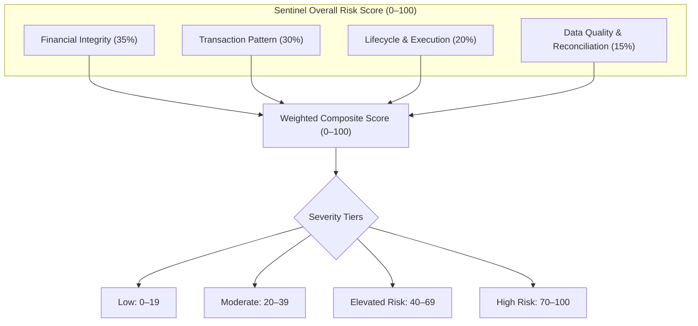

# Sentinel Risk Score v1: Analytical Design & Scoring Framework
**Specification Document — Version 1.1 (Refined Prototype Specification)**  
*Project Sentinel: AI-Powered MPLADS Monitoring & Anomaly Detection*  
*Dataset Grounding: Andhra Pradesh, Madhya Pradesh, Punjab, Telangana, Uttarakhand (1,000 works, 1,386 transactions)*  

---

## 1. Objective

The primary objective of **Sentinel Risk Score v1** is to provide an objective, mathematically defensible, and explainable prototype system that prioritizes MPLADS developmental works for human review and administrative audit.

### Core Design Principles
1. **Explainable by Construction**: Every point in the score traces directly to verifiable evidence (e.g., specific transaction vouchers, mathematical ratios, milestone dates). A reviewer is never faced with an opaque "black-box" risk rating.
2. **Non-Accusatory Classification**: Risk is framed strictly as an operational, procedural, or data-reconciliation anomaly requiring review. The system distinguishes between compliance friction, data-quality artifacts, and benign administrative peculiarities. Terms like "fraud" or "fraudulent" are strictly prohibited; the system operates on defensible categories:
   - *Low / Normal*
   - *Moderate (Review Recommended)*
   - *Elevated Risk (Audit Recommended)*
   - *High Risk (Immediate Review Required)*
3. **Decoupling Data Quality from Financial Risk**: Incomplete records or government workbook formatting differences must not be conflated with financial irregularities or redundant payments.
4. **Distribution-Aware Calibration**: Thresholds are grounded in empirical distributions of actual multi-state MPLADS data rather than arbitrary rules of thumb.
5. **Separation of Deterministic Evidence and AI Synthesis**: Deterministic algorithms compute all scores, ratios, and signal triggers. Large Language Models (LLMs) are used solely to translate structured JSON evidence into fluent, context-aware executive summaries and auditor action checklists.

---

## 2. Risk Dimensions

To prevent single indicators from distorting the overall evaluation, Sentinel v1 organizes all evidence into **four orthogonal dimensions**, each scored independently from **0 to 100**:



### Dimension 1: Financial Integrity ($D_{\text{fin}}$, Weight: 35%)
Evaluates financial scale, fund allocation coherence, and redundant disbursement exposure.
- **Key Concepts**: Potential duplicate disbursed amount relative to total expenditure, orphan disbursements, and financial completeness upon milestone achievement.
- **Focus**: Has public money been disbursed under unlinked circumstances, or is there significant financial exposure to duplicate vouchers?

### Dimension 2: Transaction Pattern ($D_{\text{tx}}$, Weight: 30%)
Evaluates procurement slicing, voucher frequency, vendor concentrations, and duplicate payment clusters.
- **Key Concepts**: Transaction count relative to work size, vendor proliferation (micro-vouchers), exact attribute matching (same work, date, vendor, status, amount), and disbursement velocity.
- **Focus**: Does the voucher structure suggest invoice splitting, repeated billing, or high expenditure during early administrative stages?

### Dimension 3: Lifecycle & Execution ($D_{\text{life}}$, Weight: 20%)
Evaluates milestone consistency, administrative delays, and project stagnation.
- **Key Concepts**: Disconnect between administrative milestone status and recorded expenditure tranches, prolonged inactivity (> 14 months without expenditure on uncompleted works), and certified completions with zero financial tracking.
- **Focus**: Is the project progressing logically along statutory milestones, or is it stalled/prematurely billed?

### Dimension 4: Data Quality & Reconciliation ($D_{\text{dq}}$, Weight: 15%)
Evaluates schema completeness, relational integrity across sheets, and ledger reconciliation.
- **Key Concepts**: Unmatched transaction work IDs (orphan disbursements), reconciliation gaps between transaction ledgers and master disbursement figures, and state-level catalog uncoupling.
- **Focus**: Can the work be fully reconciled across government ledgers, or does the file suffer from broken relational links?

---

## 3. Signal Taxonomy & Precise Terminology

### Clarifying Duplicate Terminology
To ensure judicial and technical precision, Sentinel rigorously distinguishes between duplicate metrics:
- **`participating_duplicate_rows`**: Total rows that belong to any duplicate group ($N \ge 2$).
- **`duplicate_group_count`**: Number of distinct unique transaction attribute signatures that repeat.
- **`excess_duplicate_count`**: The number of redundant repeat occurrences beyond the single original record ($\sum (\text{group\_size} - 1)$).
- **`potential_duplicate_amount`**: The cumulative financial value of those excess repeat occurrences ($\sum (\text{group\_size} - 1) \times \text{amount}$).

### Signal Definitions & Severity Points

| Dimension | Signal Identifier | Signal Name | Base Points | Trigger Condition / Formula | Empirical Prevalence in 5-State Dataset |
| :--- | :--- | :--- | :---: | :--- | :--- |
| **Financial Integrity** | `FIN_DUP_EXPOSURE_HIGH` | High Duplicate Financial Exposure | 40–70 | $\frac{\text{potential\_dup\_amt}}{\text{total\_exp}} \ge 0.30$ (scaled to 70 for $\ge 0.60$) | 14 works (1.4%) |
| | `FIN_DUP_EXPOSURE_MOD` | Moderate Duplicate Financial Exposure | 25 | $0.05 \le \frac{\text{potential\_dup\_amt}}{\text{total\_exp}} < 0.30$ | 8 works (0.8%) |
| | `FIN_ORPHAN_FUNDS` | Orphan Transaction Disbursement | 60 | Work exists in expenditure logs but has no Works Master parent | 14 works / 38 txs (2.7% of txs, Punjab) |
| | `FIN_CERTIFIED_ZERO_DISB`| Certified Completed with Zero Funds | 35 | `work_status` == "Work Completed" AND `total_exp` is NULL | 4 works (0.4%, AP & Telangana) |
| | `FIN_SEVERE_UNDER_UTIL` | Severe Under-Expenditure at Completion | 20 | `work_status` == "Work Completed" AND $\frac{\text{total\_exp}}{\text{sanction\_amt}} < 0.40$ | 3 works (0.3%) |
| **Transaction Pattern** | `TX_EXACT_DUP_CLUSTER` | Repeated Transaction Duplication | 30–50 | Excess duplicates $\ge 1$: 30 pts; $\ge 4$: 40 pts; $\ge 10$: 50 pts | 22 works (2.2%) |
| | `TX_SLICING_EXTREME` | Extreme Transaction Slicing | 35 | `exp_tx_count` $\ge 15$ (top 1% percentile) | 9 works (0.9%) |
| | `TX_SLICING_HIGH` | High Transaction Slicing | 20 | $6 \le \text{exp_tx_count} < 15$ (P95–P99) | 42 works (4.2%) |
| | `TX_VENDOR_SPRAWL_EXTREME`| Extreme Vendor Sprawl | 35 | `unique_vendor_count` $\ge 8$ (top 1% percentile) | 10 works (1.0%) |
| | `TX_VENDOR_SPRAWL_HIGH` | High Vendor Concentration | 20 | $3 \le \text{unique_vendor_count} < 8$ (P90–P95) | 45 works (4.5%) |
| | `TX_EARLY_STAGE_HIGH_EXP`| Early-Stage High Expenditure | 30 | Status in (`Sanction`, `Vendor Identification`) AND $\frac{\text{total\_exp}}{\text{sanction}} \ge 0.75$ | 67 works (6.7%) |
| **Lifecycle / Execution**| `LIFE_PROLONGED_STAGNATION`| Prolonged Inactivity on Active Work | 30 | Active work with `days_since_last_expenditure` $> 445$ days (P90) | 66 works (6.6%) |
| | `LIFE_SEVERE_DELAY_SANCTION`| Abnormal Sanction Lead Time | 20 | `days_to_sanction` $> 323$ days (P95) | 40 works (4.0%) |
| | `LIFE_SEVERE_DELAY_COMP` | Abnormal Completion Duration | 25 | `days_to_completion` $> 477$ days (P95) | 11 works (1.1%) |
| | `LIFE_STATUS_DISCONNECT` | Milestone Sequencing Inconsistency | 25 | Physical status backward relative to financial disbursement | 34 works (3.4%) |
| **Data Quality & Reconciliation** | `DQ_ORPHAN_INTEGRITY` | Missing Master Work Record | 60 | Referential integrity broken between expenditure and works | 14 works (Punjab) |
| | `DQ_DISBURSEMENT_RECONCILIATION_GAP`| Master vs Transaction Reconciliation Gap | 25 | (Tx expenditure exists BUT `amount_disbursed` is null) OR (Completed work with null `amount_disbursed`) OR (Material mismatch: $\| \text{exp} - \text{disb} \| > 0.05 \times \text{sanction}$) | 148 works (14.8%) |
| | `DQ_MISSING_REC_SERIES` | Disjoint Recommendation Series | 15 | State-level recommendation ID mismatch (AP pattern) | 200 works (AP) |
| | `DQ_MISSING_CORE_DESC` | Incomplete Work Description | 20 | `work_description` is null or empty string | 3 works (0.3%) |

> [!NOTE]
> **Refining `DQ_DISBURSEMENT_RECONCILIATION_GAP`**: Rather than penalizing all 733 works with empty master disbursement (which is standard practice for non-disbursed projects in early stages), Sentinel triggers this flag **only when an active financial reconciliation discrepancy exists**:
> 1. Transaction vouchers exist showing public funds spent, but master register reports no disbursement.
> 2. Work is certified "Work Completed", but master register has no disbursement figure.
> 3. Both fields are populated, but differ by more than 5% of the sanctioned budget.

---

## 4. Threshold Calibration (Empirical Grounding)

Thresholds are grounded directly in empirical quantiles from the 1,000-work baseline dataset:

```text
Dataset Quantile Reference (Active Works N=660, Individual Txs N=1,386)
-----------------------------------------------------------------------------------------
Metric                         P50 (Median)   P75         P90         P95         P99
-----------------------------------------------------------------------------------------
Transaction Count / Work       1 tx           2 txs       4 txs       8 txs       16 txs
Vendor Count / Work            1 vendor       1 vendor    2 vendors   5 vendors   9.4 vendors
Days Since Last Expenditure    156 days       290 days    445 days    499 days    601 days
Days to Sanction               68 days        128 days    221 days    323 days    462 days
Days to Completion             236 days       327 days    418 days    477 days    561 days
Individual Tx Amount (₹)       ₹1,00,769      ₹3,69,119   ₹6,80,245   ₹10,23,007  ₹25,14,913
```

---

## 5. Double-Counting Prevention Architecture

To prevent correlated indicators from artificially compounding risk scores:
1. **Unification of Duplicate Features**:
   - In **Transaction Pattern ($D_{\text{tx}}$)**, score **only** cluster intensity (`TX_EXACT_DUP_CLUSTER`: 30, 40, or 50 pts based on excess count).
   - In **Financial Integrity ($D_{\text{fin}}$)**, score **only** the monetary exposure ratio ($\frac{\text{potential\_dup\_amt}}{\text{total\_exp}}$).
2. **Mutually Exclusive Tiering**:
   - `TX_SLICING_EXTREME` ($\ge 15$ txs) suppresses `TX_SLICING_HIGH` ($\ge 6$ txs).
   - `TX_VENDOR_SPRAWL_EXTREME` ($\ge 8$ vendors) suppresses `TX_VENDOR_SPRAWL_HIGH` ($\ge 3$ vendors).
   - `FIN_DUP_EXPOSURE_HIGH` ($\ge 30\%$) suppresses `FIN_DUP_EXPOSURE_MOD` ($5\%-30\%$).
3. **Clean Additive Dimension Scoring**:
   - Dropped the arbitrary 1.15× multiplier to eliminate non-empirical parameters. Each dimension is strictly additive and capped at 100.

---

## 6. Scoring Formula & Aggregation Algorithm

### Mathematical Definition

For any given work $w$:

1. **Calculate Dimension Raw Scores**:
   $$D_{\text{fin}}(w) = \min\left(100, \sum_{s \in S_{\text{fin}}} \text{Points}(s)\right)$$
   $$D_{\text{tx}}(w) = \min\left(100, \sum_{s \in S_{\text{tx}}} \text{Points}(s)\right)$$
   $$D_{\text{life}}(w) = \min\left(100, \sum_{s \in S_{\text{life}}} \text{Points}(s)\right)$$
   $$D_{\text{dq}}(w) = \min\left(100, \sum_{s \in S_{\text{dq}}} \text{Points}(s)\right)$$

2. **Calculate Composite Weighted Risk Score**:
   $$\text{RiskScore}(w) = 0.35 \cdot D_{\text{fin}}(w) + 0.30 \cdot D_{\text{tx}}(w) + 0.20 \cdot D_{\text{life}}(w) + 0.15 \cdot D_{\text{dq}}(w)$$

3. **Critical Override Rule**:
   If $D_{\text{fin}}(w) \ge 70$ (e.g., majority of funds are duplicate disbursements or orphan funds), the composite score cannot fall below 70:
   $$\text{FinalRiskScore}(w) = \max\left(\text{RiskScore}(w), \mathbf{1}_{D_{\text{fin}}(w) \ge 70} \cdot 70\right)$$

### Severity Tiers

```text
+-----------------------+---------------------+-------------------------------------------------------+
| Score Range           | Risk Classification | Operational Meaning                                   |
+-----------------------+---------------------+-------------------------------------------------------+
| 0 – 19                | Low / Normal        | Standard execution; benign administrative variance.   |
| 20 – 39               | Moderate            | Minor friction, mild delay, or documentation gap.     |
| 40 – 69               | Elevated Risk       | Notable anomaly pattern; supervisory audit suggested. |
| 70 – 100              | High Risk           | Severe multi-signal anomaly; priority human review.   |
+-----------------------+---------------------+-------------------------------------------------------+
```

---

## 7. State Normalization Strategy

1. **Individual Work Scores Remain State-Agnostic**: An identical ₹7.3 Lakh duplicate payment to the same vendor receives the same severity whether it occurs in Punjab or Telangana. Diluting individual scores due to state-wide documentation issues would hide acute irregularities from auditors.
2. **Missing Feature Neutralization (AP Correction)**: For works where baseline recommendation dates are systemically absent at the state level (AP), the `Lifecycle` dimension re-weights available features rather than penalizing works for missing dates.
3. **Decoupled State Health Ratings**: Systemic issues (Punjab's orphan series, AP's catalog mismatch) are surfaced on macro dashboard benchmarks rather than distorting work-level physical risk.

---

## 8. Real-Work Example Calculations

### Case 1: Relatively Normal Work (Baseline Community Project)
- **Work ID**: [`WS/MP524/2024-2025/168911`](file:///c:/Users/jain_/Documents/SIH_dataset/processed/andhra_pradesh/works.csv#L5)
- **State & Constituency**: Andhra Pradesh, RAJAMPET
- **Work Title**: Installing tube-wells and borewells at Cheekalachenu, Moravapalli GP
- **Key Metrics**: Sanction: ₹1,94,855.00 | Disbursed: ₹1,94,855.00 | Total Exp: ₹1,94,855.00 | Status: `Physical Inspection` | Tx Count: 1 | Vendor Count: 1 | Duplicates: 0 | Completion Date: 2025-03-24
- **Signal Triggers**:
  - Lifecycle: `LIFE_PROLONGED_STAGNATION` (Last expenditure was 530 days ago while in inspection): **30 pts**
  - Data Quality: `DQ_MISSING_REC_SERIES`: **15 pts** (state-level catalog gap)
- **Dimension Scores**: $D_{\text{fin}} = 0$, $D_{\text{tx}} = 0$, $D_{\text{life}} = 30$, $D_{\text{dq}} = 15$.
- **Composite Score**: $(0.35 \times 0) + (0.30 \times 0) + (0.20 \times 30) + (0.15 \times 15) = 6.0 + 2.25 = 8.25 \rightarrow \mathbf{8}$.
- **Risk Level**: **Low / Normal**
- **Explanation**: Clean project execution matching budget with 1 transaction and 1 vendor. The minor score reflects inspection inactivity and state catalog uncoupling, well below any review threshold.

---

### Case 2: Clearly High-Risk Work (Severe Compounded Anomaly)
- **Work ID**: [`WS/MP18152/2025-2026/220384`](file:///c:/Users/jain_/Documents/SIH_dataset/processed/punjab/work_features.csv#L10)
- **State & Constituency**: Punjab, FARIDKOT (SC)
- **Work Title**: Construction of roads, link roads, pathways with drainage
- **Key Metrics**: Sanction: ₹15,00,000.00 | Total Exp: ₹15,00,000.00 | Status: `Vendor Identification` | Tx Count: 29 | Vendor Count: 2 | Participating Dup Rows: 25 | Duplicate Groups: 4 | Excess Duplicate Count: 21 | Potential Dup Amount: ₹9,46,275.00
- **Signal Triggers**:
  - Financial: `FIN_DUP_EXPOSURE_HIGH` ($\frac{9,46,275}{15,00,000} = 63.1\%$ duplicate exposure): **70 pts**
  - Transaction: `TX_SLICING_EXTREME` (29 txs): **35 pts**
  - Transaction: `TX_EXACT_DUP_CLUSTER` (21 excess duplicate records): **50 pts**
  - Transaction: `TX_EARLY_STAGE_HIGH_EXP` (100% of sanctioned amount represented by expenditure while in `Vendor Identification`): **30 pts**
  - Lifecycle: `LIFE_STATUS_DISCONNECT` (Financial execution complete prior to physical contracting): **25 pts**
  - Data Quality: `DQ_DISBURSEMENT_RECONCILIATION_GAP` (₹15L in transactions but master disb is null): **25 pts**
- **Dimension Scores**:
  - $D_{\text{fin}} = 70$
  - $D_{\text{tx}} = \min(100, 35 + 50 + 30) = 100$
  - $D_{\text{life}} = 25$
  - $D_{\text{dq}} = 25$
- **Composite Score**: $(0.35 \times 70) + (0.30 \times 100) + (0.20 \times 25) + (0.15 \times 25) = 24.5 + 30.0 + 5.0 + 3.75 = 63.25 \rightarrow \mathbf{70}$ (Critical Override).
- **Risk Level**: **High Risk (Immediate Review Required)**
- **Explanation**: 100% of the sanctioned amount (₹15 Lakhs) is represented by recorded expenditure transactions across 29 separate vouchers while the project remains officially at the preliminary 'Vendor Identification' stage. 25 of the 29 transactions participate in duplicate clusters across 4 groups, representing 21 excess duplicate transactions and ₹9,46,275 in redundant disbursements (63.1% exposure ratio).

---

### Case 3: Data Quality & Reconciliation Anomaly (Certified Complete without Financial Trail)
- **Work ID**: [`WS/MP18009/2024-2025/161404`](file:///c:/Users/jain_/Documents/SIH_dataset/processed/andhra_pradesh/works.csv#L58)
- **State & Constituency**: Andhra Pradesh, BAPATLA (SC)
- **Work Title**: Construction of community centers and community halls
- **Key Metrics**: Sanction: ₹10,00,000.00 | Disbursed: NULL | Total Exp: NULL (0 txs) | Status: `Work Completed` (Completed 2025-09-02)
- **Signal Triggers**:
  - Financial: `FIN_CERTIFIED_ZERO_DISB` (Certified completed with ₹0 recorded funds): **35 pts**
  - Data Quality: `DQ_DISBURSEMENT_RECONCILIATION_GAP` (Work completed but master disb is null): **25 pts**
  - Data Quality: `DQ_MISSING_REC_SERIES` (State catalog uncoupling): **15 pts**
- **Dimension Scores**: $D_{\text{fin}} = 35$, $D_{\text{tx}} = 0$, $D_{\text{life}} = 0$, $D_{\text{dq}} = 40$.
- **Composite Score**: $(0.35 \times 35) + (0.30 \times 0) + (0.20 \times 0) + (0.15 \times 40) = 12.25 + 0 + 0 + 6.0 = 18.25 \rightarrow \mathbf{18}$.
- **Risk Level**: **Low / Normal (Data Reconciliation Flag)**
- **Explanation**: Physical structure certified complete on 2025-09-02, but zero financial expenditure records exist in either master or transaction ledgers ("Zombie" completion). The work receives a baseline score of 18 driven entirely by data-quality gaps, cleanly separating administrative record health from active procurement risk.

---

## 9. Rich Evidence JSON Contract

The backend generates structured evidence payloads containing the exact transaction vouchers behind each triggered signal:

```json
{
  "work_id": "WS/MP18152/2025-2026/220384",
  "state": "Punjab",
  "constituency": "FARIDKOT(SC)",
  "mp_name": "SARABJEET SINGH KHALSA",
  "work_category": "Normal/Others",
  "work_title": "Construction of roads, link roads, pathways with drainage",
  "sanction_amount": 1500000.0,
  "total_expenditure": 1500000.0,
  "amount_disbursed": null,
  "work_status": "Vendor Identification",
  "risk_score": 70,
  "risk_level": "High Risk",
  "requires_human_review": true,
  "dimension_scores": {
    "financial_integrity": 70,
    "transaction_pattern": 100,
    "lifecycle_execution": 25,
    "data_quality": 25
  },
  "summary_metrics": {
    "expenditure_transaction_count": 29,
    "unique_vendor_count": 2,
    "participating_duplicate_rows": 25,
    "duplicate_group_count": 4,
    "excess_duplicate_count": 21,
    "potential_duplicate_amount": 946275.0,
    "expenditure_vs_sanction_ratio": 1.0,
    "days_since_last_expenditure": 128
  },
  "triggered_signals": [
    {
      "signal_id": "FIN_DUP_EXPOSURE_HIGH",
      "dimension": "financial_integrity",
      "severity": "High",
      "points_assigned": 70,
      "title": "Severe Potential Duplicate Disbursed Amount",
      "evidence_summary": "21 excess duplicate transactions account for ₹9,46,275.00 out of ₹15,00,000.00 total expenditure (63.1% exposure ratio).",
      "threshold": ">= 30.0% duplicate expenditure ratio",
      "observed_value": "63.08%",
      "evidence_transactions": [
        {
          "expenditure_id": "EXP-000211",
          "date": "2026-04-10",
          "vendor": "M/S GURDEV TRADERS",
          "amount": 34410.0,
          "duplicate_group_id": "DUP-BE838D72481686AB"
        }
      ]
    },
    {
      "signal_id": "TX_EXACT_DUP_CLUSTER",
      "dimension": "transaction_pattern",
      "severity": "High",
      "points_assigned": 50,
      "title": "Large Cluster of Exact Duplicate Transactions",
      "evidence_summary": "25 transactions participate across 4 duplicate groups, resulting in 21 excess duplicate records.",
      "threshold": ">= 10 excess duplicate records",
      "observed_value": 21,
      "evidence_transactions": [
        {
          "expenditure_id": "EXP-000210",
          "date": "2026-04-10",
          "vendor": "M/S GURDEV TRADERS",
          "amount": 34410.0,
          "duplicate_group_id": "DUP-BE838D72481686AB"
        }
      ]
    }
  ]
}
```

---

## 10. Implementation Plan: `sentinel_scorer.py`

### Module Specification
- **Script**: `scripts/sentinel_scorer.py` (Pure Python standard library; zero external dependencies required).
- **Inputs**: Reads `data/processed/<state>/` CSVs for all 5 states.
- **Outputs**: Generates `data/scored/` directory:
  1. `data/scored/work_risk_scores.csv`
  2. `data/scored/risk_signals.csv`
  3. `data/scored/risk_evidence.json`
